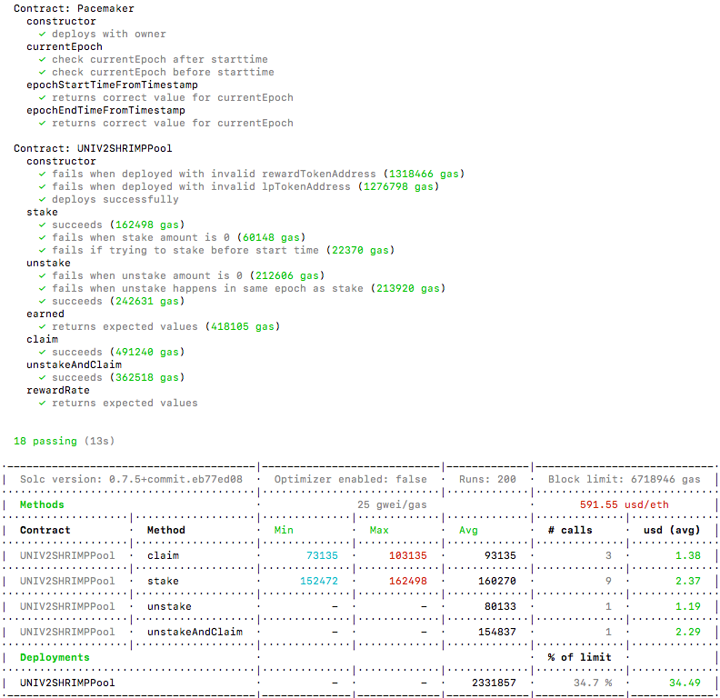
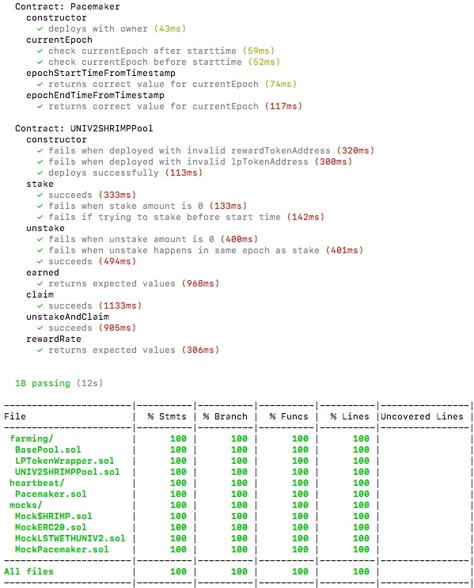

# Whalestreet-contracts
 Whalestreet Contracts.

## Framework
The farming module consists of 3 main smart contracts:

1. BasePool.sol
2. LPTokenWrapper.sol
3. UNIV2SHRIMPPool.sol

All the contracts in this repository have been written in Solidity v0.7.5

Please use Git commits according to this article: https://chris.beams.io/posts/git-commit

## Installation and setup
* Clone this repository

  `git clone <repo>`

* cd into the cloned repo

  `cd Whalestreet-contracts`

* Install dependencies via npm

  `npm install`

## Test and development

* Open new terminal, run ganache

  `ganache-cli`

* Open new terminal, Compile the contracts

  `npm run build`

* Run the tests

  `npm run test`

  Output :
  

* Run the covergae

  `npm run test-coverage`

  Output :
  
